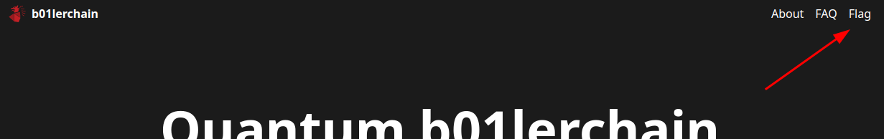
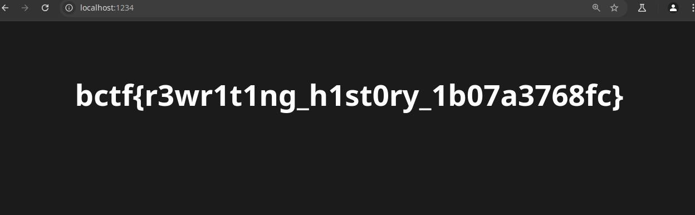

# b01lersCTF — “Trouble at the spa” Write‑Up

---

## Why I Picked This One

Well I have be honest i randomly picked this one and turns out this is a react app and since it does client side rendering i figured it would be very simple to get the flag.

---

## What You Need

- **OS:** Any OS 
- **Python:** 3.0+ (I tested on 3.12)
- **Tools:** 
  - A Browser
  - `wget`

---

## The Challenge in a Nutshell

The web app shows a link named Flag



Clicking the link leads to 404. I figured this is because of github not being compatible with `react-router-dom` a library used for client side routing for react SPA (Single Page Application)

 

Inspecting code in the browser speicially the js file shows that the code is obfuscated and there is no direct way to see the and understand the text

### The Big Idea

Since react uses a router to load the page and the obfuscated code is working perfectly with this router if i can load the flag page i can solve this puzzle.

---

## Step 1: Download the source code

```bash
wget -r -np -k -p https://ky28060.github.io/ 
```

### Explanation of each flag:

| Option | Meaning                                                                                                                       |
| ------ | ----------------------------------------------------------------------------------------------------------------------------- |
| `-r`   | **Recursive download** – downloads not just the page, but everything linked from it (like sub-pages, images, etc.).           |
| `-np`  | **No parent** – prevents `wget` from going to parent directories (i.e., it stays within the given domain or directory level). |
| `-k`   | **Convert links** – after downloading, it rewrites the links in the HTML so that they work locally.                           |
| `-p`   | **Download page requisites** – grabs all files necessary to properly display the page (images, CSS, JS, etc.).                |

---

## Step 2: Edit the obfuscated js file

Before

```js
p4.createRoot(document[Ie(325, "mafo") + Ie(366, "8Z29") + Ie(293, "%E[k")](Ie(323, "x3Z9")))[Ie(368, "@uW%") + "r"](I.jsx(U.StrictMode, {
    children: I.jsx(zr, {
        children: I.jsxs(sr, {
            children: [I.jsx(Ff, {
                index: !0,
                element: I.jsx(u5, {})
            }), I.jsx(Ff, {
                path: Ie(300, "FEQ%"),
                element: I.jsx(i5, {})
            })]
        })
    })
}));
```

After

```js
p4.createRoot(document[Ie(325, "mafo") + Ie(366, "8Z29") + Ie(293, "%E[k")](Ie(323, "x3Z9")))[Ie(368, "@uW%") + "r"](I.jsx(U.StrictMode, {
    children: I.jsx(zr, {
        children: I.jsxs(sr, {
            children: [I.jsx(Ff, {
                index: !0,
                element: I.jsx(i5, {})
            }), I.jsx(Ff, {
                path: Ie(300, "FEQ%"),
                element: I.jsx(i5, {})
            })]
        })
    })
}));
```

---

## Step 3: Serve the download files with edited js file

```bash
python -m http.server 1234
```

---

## Step 4: Open url in the browser and get the flag



---

## Lessons Learned

1. **Never Ever Leave Anything Secret on Client Side**: Always keep the secrets and private on the server side and make sure they are protected there as well.

That’s it! Hope you enjoyed this walk‑through—feel free to drop me a message if anything’s unclear. Good luck on the rest of the CTF!
